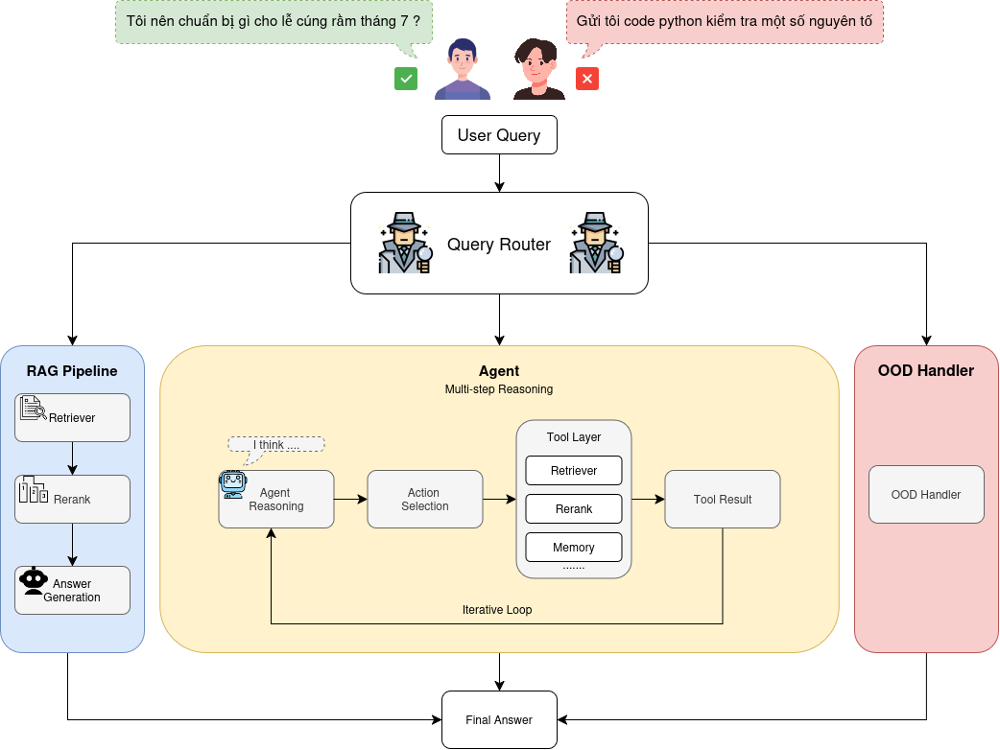

# TC-Agent

TC-Agent là một hệ thống AI Agent phục vụ các tác vụ liên quan đến **thờ cúng và văn hóa Việt Nam**.

Dự án được xây dựng theo kiến trúc module, trong đó Agent có thể sử dụng các công cụ như **RAG, Reranker và Memory**.

## System Pipeline

The overall system architecture is shown below.



*Figure 1. Overview of the TC-Agent system pipeline.*

## Cấu trúc thư mục

```text
tc-agent/
│
├── src/
│   ├── agent/                  # Agent reasoning / ReAct
│   │
│   ├── rag/                    # Direct RAG pipeline
│   │
│   ├── router/                 # Quyết định Agent / RAG / OOD
│   │
│   ├── tools/                  # Các capability mà Agent có thể gọi (có thể thêm)
│   │   ├── retriever/          # Retrieval tool
│   │   ├── reranker/           # Reranking tool
│   │   └── memory/             # Memory
│   │
│   └── main.py                 # File chạy thử, nối các module
│
├── eval/                       # Code đánh giá và đo lường hệ thống
├── assets/                     # Hình ảnh và tài nguyên của project
│   └── pipeline.png
│
└── requirements.txt            # Các thư viện cần cài
```

## Môi trường

* **Python 3.11**
* Các thư viện cần thiết được liệt kê trong `requirements.txt`.

```bash
python3.11 -m venv venv
source venv/bin/activate
pip install -r requirements.txt
```

